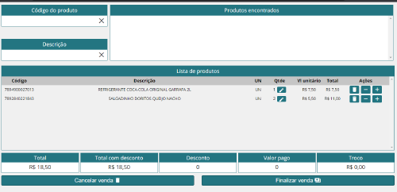

# PDV (Ponto de Venda) - Tela com React

Esse é um projeto desenvolvido em React para uma tela de PDV (Ponto de Venda). Ele foi criado como parte do aprendizado de React, utilizando os hooks `useState`, `useEffect` e `useRef`. 



## Funcionalidades

A tela de PDV é composta por algumas funcionalidades principais:

- Buscar e selecionar um produto na lista de produtos
- Adicionar o produto ao carrinho
- Alterar a quantidade ou remover produto do carrinho
- Verificar o total da compra
- Informar desconto
- Informar valor pago
- Finalizar venda
- Cancelar venda

## Instalação

Para rodar o projeto localmente, você precisa clonar o repositório para o seu computador e instalar as dependências. Você pode fazer isso rodando os seguintes comandos no terminal:

```
git clone https://github.com/seu-usuario/pdv-react.git
cd pdv-react
npm install
```

Após a instalação das dependências, você pode iniciar o servidor local rodando o seguinte comando:

```
npm start
```

Isso iniciará o servidor local em http://localhost:3000.

Projeto disponível em: https://tela-pdv-react.vercel.app/


